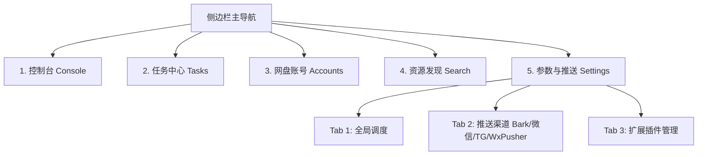

# UCAS 统一云盘自动转存系统：UI/UX 全面重构设计规范 (Cyber-Dark Spec)

## 1. 目标与背景 (Goal & Background)

目前 UCAS 系统虽然功能完整，但前端在页面布局、UI视觉表现力、功能模块划分上存在碎片化和不够直观的问题。本规范旨在实施**方案二：全系统 UI/UX 重构**，通过引入 Futuristic Cyber-Dark（现代科技感暗黑风）视觉系统，并将页面由 8 个合并精简为 5 个核心主控模块，彻底改写整个系统的交互体验。

---

## 2. 模块重组与路由规划 (Information Architecture)

我们将对左侧侧边栏导航和路由结构进行整合收纳，精简为 5 个核心模块，路由对应配置如下：



### 2.1 模块具体定位：
1. **控制台 (Console / 旧 Dashboard)**：
   - 采用**三栏极客式布局**，提升信息统揽效率。
   - **左栏（系统状况与遥测）**：展示 CPU、内存、网络 IO 波形，存储池配额进度圆环。
   - **中栏（活跃任务流）**：展示当前正在运行的任务，卡片带有呼吸微光及动态进度条动画。
   - **右栏（系统运行日志）**：默认折叠状态，过滤并高亮警告或错误事件，正常日志以极其低调的微光微缩行单向滚动。
2. **任务中心 (Tasks)**：
   - 保留表格与磁贴两种视图切换。
   - 摒弃以往的居中遮罩弹窗，所有新建/编辑操作统一改为**从屏幕右侧轻柔滑出的悬浮毛玻璃抽屉 (Slide Drawer)**。
   - 抽屉顶部新增**“智能粘贴解析框”**，粘贴类似 `链接 密码` 或包含中文描述的文本后，前端自动用正则提取 URL 与提取码并填入表单，减少表单项填写频次。
3. **网盘账号 (Accounts)**：
   - 采用网格磁贴布局（Grid Cards），磁贴采用毛玻璃背景辅以微光投影。
   - Hover 悬浮在磁贴上时，展示账号的详细容量分布环（Element Plus 极简 Circle 进度条）。
4. **资源发现 (Search)**：
   - 精美的搜索输入栏。点击“创建任务”在路由跳转时以 Query 带参传递，由 Tasks 页面的 `onMounted` 自动打开右侧创建抽屉并预填。
5. **参数与推送 (Settings / 合并原 Settings + Notify + Plugins)**：
   - 收纳所有管理配置项，彻底消除多页面跳转配置的逻辑断层。
   - 采用内部 Tab 切换：`全局参数`、`消息通知 (Bark/企业微信/Telegram/WxPusher)`、`内置扩展插件管理`。

---

## 3. 视觉规范与设计代币 (Visual Token System)

我们将通过在 [web/src/assets/styles/variables.css](file:///home/zcq/Github/clouddrive-auto-save/web/src/assets/styles/variables.css) 中声明 CSS Variables，在全局强制执行下述视觉系统：

### 3.1 色彩代币 (Colors):
- **深色基础背景 (Base BG)**：`#090d1a` (极深靛黑色，比纯黑更有空间层次感)
- **卡片/抽屉背景 (Surface BG)**：`rgba(17, 22, 40, 0.75)` (半透明墨黑色)
- **科技霓虹青 (Teal Accent)**：`#00f2fe` / `rgb(0, 242, 254)` (主操作、按钮、进度条高光)
- **极光炫彩绿 (Aurora Green)**：`#39ff14` / `rgb(57, 255, 20)` (成功、运行中、健康状态高光)
- **警示霓虹橙 (Warning Orange)**：`#ff7b00` (警示、失败、异常高亮)

### 3.2 质感代币 (Material & Effects):
- **毛玻璃效果 (Glassmorphism)**：
  ```css
  background: var(--surface-bg);
  backdrop-filter: blur(16px);
  -webkit-backdrop-filter: blur(16px);
  border: 1px solid rgba(255, 255, 255, 0.08);
  ```
- **微发光阴影 (Neon Glows)**：
  ```css
  box-shadow: 0 0 15px rgba(0, 242, 254, 0.12), 0 8px 32px 0 rgba(0, 0, 0, 0.5);
  ```
- **呼吸发光动画 (Breathing Animation)**：
  对运行中的任务卡片使用微光呼吸特效（利用 CSS `keyframes` 改变 `box-shadow` 透明度）。

---

## 4. 拟修改与重构的文件清单 (Proposed File Changes)

### 4.1 新增/合并页面：
* **[NEW / MERGE]** `web/src/views/Settings.vue`
  - 整合原 `Settings.vue`、`Notify.vue`、`Plugins.vue` 的全部功能与状态，重构为带 `<el-tabs>` 的集成式系统设置视图。
* **[DELETE]** `web/src/views/Notify.vue`
  - 功能并入配置页，删除此冗余文件。
* **[DELETE]** `web/src/views/Plugins.vue`
  - 功能并入配置页，删除此冗余文件。

### 4.2 路由与导航重划：
* **[MODIFY]** `web/src/router/index.js` (或 index.ts)
  - 移出 `/notify`、`/plugins` 路由，精简 Settings 页面对应路由，重命名 Dashboard 为 Console。
* **[MODIFY]** `web/src/config/navigation.ts` (或 layouts 侧边栏配置)
  - 移出已删除模块对应的图标，导航菜单缩减至 5 个。

### 4.3 界面重绘：
* **[MODIFY]** `web/src/views/Dashboard.vue` (更名为控制台布局)
  - 重构 HTML 结构为三栏栅格比例，左侧显示系统资源健康指标，中间显示活跃 Worker 正在执行的任务状态卡片，右侧为嵌入式微型终端日志组件。
* **[MODIFY]** `web/src/views/Tasks.vue`
  - 将 `<el-dialog>` 替换为 `<el-drawer>` 并应用毛玻璃蒙版。
  - 新增智能粘贴解析输入组件 `SmartPasteInput` 并将其置于抽屉表单顶部。
* **[MODIFY]** `web/src/views/Accounts.vue`
  - 将表格重塑为卡片网格布局，并使用 GORM 提供的数据（VIP类型、账号状态、空间配额）通过 Element Plus 圆环进度条形式展示。
* **[MODIFY]** `web/src/assets/styles/index.css`
  - 覆盖 Element Plus 的暗黑模式默认样式，加入毛玻璃 `.glass-card`、霓虹边框 `.neon-border` 等全局控制类。

---

## 5. 验证与测试计划 (Verification)

### 5.1 界面与样式检验 (Manual)
1. 切换深色/浅色模式，验证系统默认完美呈现 Cyber-Dark 暗色系，且没有文字因背景变黑而产生对比度不足的问题（全量使用 HSL/CSS 变量适配）。
2. 在搜索页中选中任意分享并点击创建任务，验证是否能完美右滑唤起抽屉并预填。
3. 验证 Settings 的三个内部 Tab 相互切换时能够正确加载各自的全局参数、微信通知以及插件详情，无接口失效报错。

### 5.2 端到端回归测试 (E2E Regression)
- 由于我们重划了路由定义（删除了旧的 `/notify` 和 `/plugins`，将其合并为 Settings 下的 Tab，并重构了 Tasks 表单创建方式），原有 E2E 测试中的部分选择器可能会失败。
- **任务目标**：修改 `e2e/tests/` 下涉及 Settings、Notify、Tasks 创建的测试脚本，适配最新的右滑抽屉 DOM 和 Settings Tab 选项卡，确保运行 `make e2e-test` 重新达成 **100% 测试通关 (All Passed)**。
